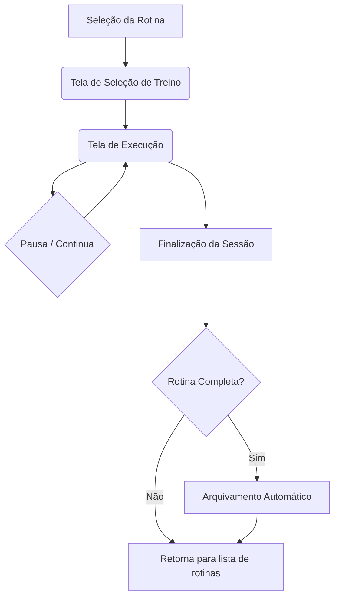

# 🏋️ Sistema de Execução de Rotinas

Este documento descreve a arquitetura e o fluxo de funcionamento do sistema de execução de rotinas de treino, uma funcionalidade central da plataforma.

---

## 🎯 Visão Geral

O sistema permite que tanto **Personal Trainers (PTs)** quanto **Alunos** executem uma sessão de treino planejada. A interface e a lógica de execução são unificadas, garantindo uma experiência consistente, enquanto as permissões de acesso e o fluxo de navegação são adaptados para cada perfil.

---

## 📂 Estrutura de Arquivos

A funcionalidade é construída em torno de um hook principal que centraliza a lógica e um componente que renderiza a interface.

```
src/
├── pages/
│   ├── ExecucaoSelecionarTreino.tsx  # Página para listar e selecionar a sessão de treino
│   └── ExecucaoExecutarTreino.tsx    # Página que renderiza o Executor
├── components/
│   └── rotina/
│       └── execucao/
│           ├── Executor.tsx          # Componente principal da UI de execução
│           └── shared/               # Componentes reutilizáveis da execução
│               ├── RegistroSerieSimples.tsx
│               ├── RegistroSerieCombinada.tsx
│               ├── CronometroSerie.tsx
│               ├── CronometroExercicio.tsx
│               ├── ExercicioDetalhesModal.tsx
│               └── ExercicioHistoricoModal.tsx
├── hooks/ 
│   ├── useExercicioExecucao.ts       # Hook com toda a lógica de negócio da execução.
│   └── useExercicioLookup.ts         # Hook auxiliar para buscar detalhes dos exercícios (nome, equipamento).
└── types/
    └── exercicio.types.ts            # Tipagens de dados do sistema
```

---

## 🔄 Fluxo de Funcionamento

O fluxo é linear, desde a seleção da sessão até sua finalização e arquivamento automático.



### 1. Ponto de Entrada e Seleção de Treino
- O usuário (PT ou Aluno) seleciona uma rotina de treino ativa.
- A aplicação navega para a página `/execucao-rotina/selecionar-treino/:rotinaId`, que renderiza o componente `ExecucaoSelecionarTreino.tsx`.
- Esta tela exibe todas as sessões de treino (`execucoes_sessao`) planejadas para a rotina, mostrando o status de cada uma (Em aberto, Pausada, Concluída).
- Ao selecionar uma sessão, a aplicação atualiza o status da mesma para `em_andamento` (se aplicável) e navega para a tela de execução.

### 2. Tela de Execução (`Executor.tsx` + `useExercicioExecucao.ts`)
- O hook `useExercicioExecucao` é o "cérebro" da operação:
    1.  **Validação de Acesso:** Antes de carregar, verifica se o usuário tem permissão para executar a sessão. A rotina não pode ter status `Cancelada` ou `Bloqueada`, e se o executor for um aluno, a rotina deve ter `permite_execucao_aluno = true`.
    2.  **Carregamento de Dados:** Busca os dados da sessão, os exercícios do treino (`exercicios_rotina`) e as séries planejadas (`series`).
    3.  **Carregamento de Progresso:** Busca o progresso já salvo (se a sessão foi pausada) da tabela `execucoes_series` e o mescla com os dados planejados.
- O componente `Executor.tsx` renderiza a lista de exercícios e suas respectivas séries (`RegistroSerieSimples` ou `RegistroSerieCombinada`).
- O usuário preenche os dados de cada série (repetições, carga) e clica em "Finalizar Série".
- Após cada série, um modal de cronômetro (`CronometroSerie`) é exibido para o descanso.
- Ao final de um exercício, o `CronometroExercicio` é exibido para o descanso entre exercícios.

### 3. Pausa e Continuação
- Ao clicar em "Pausar", a função `pausarSessao` é chamada.
- O progresso atual (séries executadas) é salvo na tabela `execucoes_series` via `upsert`.
- O status da sessão na tabela `execucoes_sessao` é atualizado para `pausada`, e o tempo decorrido é salvo.
- Ao retornar para uma sessão pausada, o hook carrega o progresso e o tempo salvos.

### 4. Finalização da Sessão
- Ao clicar em "Finalizar", a função `salvarExecucaoCompleta` é chamada.
- O progresso de todas as séries é salvo em `execucoes_series`.
- O status da sessão em `execucoes_sessao` é atualizado para `concluida`.
- O sistema então verifica se esta era a última sessão pendente da rotina para iniciar o processo de arquivamento.

---

## 🧩 Componentes Chave
A tela de execução é composta por vários componentes especializados que lidam com partes específicas da interface.
-   **`RegistroSerieSimples.tsx` e `RegistroSerieCombinada.tsx`**:
    -   São os componentes responsáveis por renderizar a interface de registro para cada série.
    -   Eles recebem os dados planejados (meta de repetições/carga) e o progresso salvo (valores iniciais).
    -   Contêm os campos de input para o usuário registrar o que foi executado.
    -   Ao finalizar, invocam a callback `onSave` que comunica os dados de volta ao `Executor.tsx`.
-   **`CronometroSerie.tsx` e `CronometroExercicio.tsx`**:
    -   Modais que exibem um cronômetro de contagem regressiva para os intervalos de descanso.
    -   `CronometroSerie` é usado para o descanso *entre as séries* de um mesmo exercício.
    -   `CronometroExercicio` é usado para o descanso *entre exercícios diferentes* e exibe qual é o próximo exercício a ser executado.
-   **`ExercicioDetalhesModal.tsx` e `ExercicioHistoricoModal.tsx`**:
    -   Modais que fornecem informações adicionais ao usuário.
    -   `Detalhes` exibe informações técnicas do exercício (músculos, instruções).
    -   `Histórico` exibe o histórico de execuções anteriores daquele exercício para o aluno.

---

## 🗄️ Arquivamento Automático de Rotina
Este processo é acionado automaticamente quando a última sessão pendente de uma rotina é finalizada.

1.  **Verificação (`verificarRotinaCompleta`):** O sistema consulta a tabela `execucoes_sessao` para confirmar que não há mais nenhuma sessão com status diferente de `concluida` para a `rotina_id` em questão.

2.  **Atualização de Status:** O status da rotina na tabela `rotinas` é alterado para `Concluída`.

3.  **Processo de Arquivamento (`arquivarRotinaCompleta`):**
    -   **Busca de Dados:** Coleta todos os dados da rotina, treinos, exercícios, séries e execuções.
    -   **Geração de PDF:** Invoca a Edge Function `gerar-pdf-conclusao`, enviando os dados coletados para gerar um PDF de resumo completo.
    -   **Lógica FIFO:** O sistema verifica a tabela `rotinas_arquivadas` para o aluno. Se já existirem 4 rotinas arquivadas, a mais antiga é removida para dar lugar à nova (First-In, First-Out). A remoção inclui deletar o PDF antigo do Cloudflare R2.
    -   **Upload do PDF:** O novo PDF é enviado para o Cloudflare R2 através da Edge Function `upload-media`.
    -   **Registro de Arquivo:** Um novo registro é criado na tabela `rotinas_arquivadas` com os metadados da rotina e a URL do PDF.
    -   **Limpeza:** A rotina original é deletada da tabela `rotinas`. Graças à configuração `ON DELETE CASCADE` no banco de dados, todos os dados relacionados (treinos, exercícios, séries, sessões de execução) são removidos automaticamente das tabelas ativas.

---

## 👤 Diferenças de Perfil (PT vs. Aluno)
A lógica de execução é a mesma, mas o acesso e a interface possuem distinções:

| Característica | Modo Personal Trainer | Modo Aluno |
|---|---|---|
| **Acesso** | Acesso total a qualquer rotina de seus alunos. | Acesso apenas às suas próprias rotinas e somente se `permite_execucao_aluno = true`. |
| **Interface** | O cabeçalho da tela de execução exibe o nome do aluno. | O cabeçalho exibe uma saudação para o aluno. |
| **Navegação** | Ao finalizar, retorna para a página de rotinas do aluno (`/alunos-rotinas/:id`). | Ao finalizar, retorna para a sua área de rotinas (`/minhas-rotinas`). |